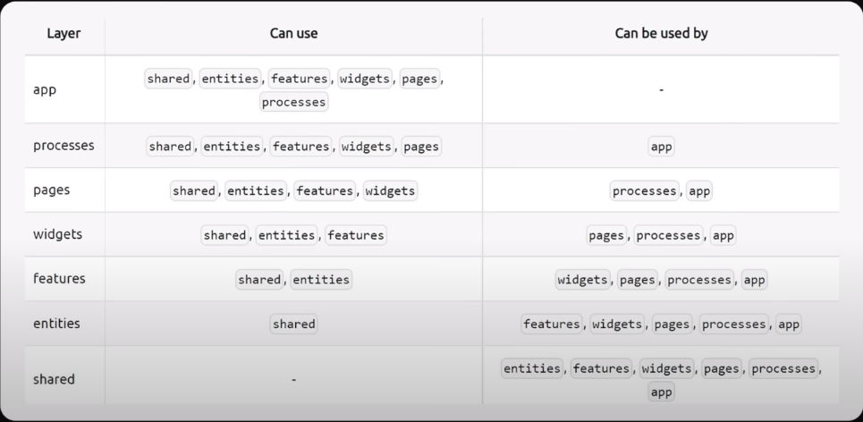

# Памятка FSD методологии

## Слои

- **app/**        - # Инициализирующая логика
- **processes/**  - # Процессы приложения, которые протекают на страницах 
- **pages/**      - # Страницы приложения  
- **widgets/**    - # Самостоятельные блоки приложения. Например: **Sidebar**, **Header**
- **features/**   - # Сценарии действия пользователя. Например: **AddToCard**, **ChangeUserStatus**
- **entities/**   - # Бизнес - сущности приложения, которыми пользуются пользователи. Например: **User**, **Product**
- **shared/**     - # Переипользуемые модули, которые не относятся к бизнес логике. Например: **UI**, **heplers**, **api**, **config**, **directives**

### Использование слоев

